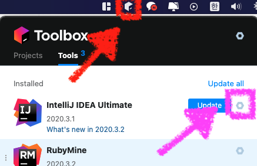
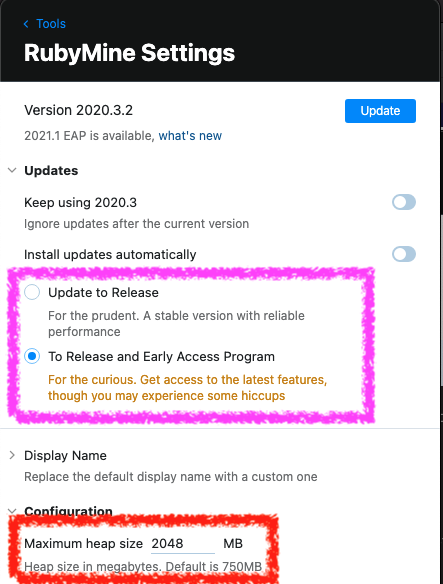

이 글은 인프런의 이동욱강사님의 `IntelliJ를 시작하시는 분들을 위한 IntelliJ 가이드`를 토대로 작성한 `첫번째`글입니다.  

Jetbrain사의 `IntelliJ`를 기준으로 작성한 글이지만 Jetbrain사의 거의 모든 IDE에서 공용되는 단축키들을 정리해놓은 글입니다.  

이 글에서 소개하는 단축키들을 자신의 것으로 만들면 개발을 하는데 있어 분명한 도움이 될것입니다.

# Tool Box App

Jetbrain사 홈페이지에서 IDE들을 설치하기 보다는 Tool Box를 통해 모든 Jetbrain사 IDE들을 `설치 및 관리` 하는게 좋습니다. [설치링크](https://www.jetbrains.com/ko-kr/toolbox-app/)

아래와 같이 다운로드 완료후의 모습은 사진과 같으며 `Mac OS`을 기준으로 상단바에 상자 아이콘(빨간 화살표)을 통해 Tool Box를 실행 가능합니다.

### 무료버전과 유료버전
IntelliJ는 무료와 유료버전이 아래와 같은 차이가 있습니다. 즉, 웹관련 툴은 유료버전만 사용가능합니다.

IntelliJ IDEA `Community` (무료) : `자바`, `Groovy`, `Gradle`, `Git` 사용가능  
Intellij IDEA `Ultimate` (유료) : `Community버전 기능` + `서블릿`, `톰캣`, `스프링`, `스프링부트`, `JSP`, `JS` 까지 사용가능합니다.  

### IDE 설정
분홍색 화살표를 통해 톱니바퀴 모양을 클릭하면 다양한 설정을 할수있습니다 

이클립스(Eclipse)와는 달리 터미널이나, XML코드를 직접 짜지않고도 툴박스로 IDE의 최대 메모리 힙사이즈(Max Heap Size)를 조절가능합니다. 
   - 보통 자신의 컴퓨터 메모리가 8GB면 힙 사이즈를 1GB를 추천하며, 16GB는 2~4GB 추천합니다.
   - Release(정식)버전과 EAP(Preview)버전 으로 업데이트 가능하며 EAP는 안정성이나 플러그인 호환성을 보장하지 못합니다.
   - 분홍색부분이 업데이트부분이며 저는 현재 EAP버전으로 업데이트하는 버튼을 클릭한 상태입니다.
   - 빨강색부분 Max Heap Size를 설정하는 이곳입니다.

